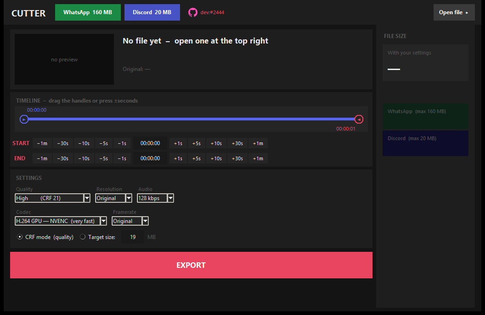

# Cutter

**Trim a video and export it right under a WhatsApp or Discord size limit - or by quality.**

---

Open a video, drag the two handles on the timeline (or nudge them by seconds), and export. Two quick buttons aim straight for **WhatsApp's 160 MB** and **Discord's 20 MB** upload limits by computing the bitrate needed to just fit - or pick a quality preset (CRF) instead and let the size fall out naturally. The sidebar shows a live size estimate and whether it fits each limit before you even export.

## What it does

- **One-click WhatsApp / Discord export** - the target size is hit by computing the exact video bitrate needed for your trimmed range
- **Quality mode** - 7 CRF presets from *Very low* to *Ultra high*, plus a **stream-copy** option (no re-encoding, fastest, exact original quality)
- Resolution (Original down to 360p), audio bitrate (or copy), framerate, and a codec choice: **H.264/H.265 CPU or NVENC (GPU)**
- Draggable dual-handle timeline with a live thumbnail preview at the current position
- Live size estimate with colour-coded WhatsApp/Discord fit indicators, updated as you change any setting
- Runs the export in the background - the window stays responsive

## Download

Grab **`Cutter.exe`** from the [releases page](../../releases) or straight from this repository. Needs `ffmpeg` and `ffprobe` on your PATH (`winget install Gyan.FFmpeg`).

New to this? Follow **[SETUP-HELP.md](SETUP-HELP.md)** - it walks you through installing and starting it.

## About this rebuild

This tool was originally called "Schneiden" (German for "cutting"). Its Python source was lost - only a stale bytecode cache survived on disk, from Python 3.14, a version no public decompiler supports yet. It was rebuilt by disassembling that bytecode by hand (`dis`), reconstructing the exact logic function by function, then rewriting it in English with a size-limit update and this project's usual signature. The size-estimation math, the ffmpeg command construction and the range-slider widget were verified against the original bytecode line by line and tested end to end with real exports.

## Notes

- Requires ffmpeg (LGPL/GPL depending on build) on your PATH; it is not bundled.

---

Made by **dev:#2444** - [github.com/hash2444](https://github.com/hash2444) - [cutter](https://github.com/hash2444/cutter)
